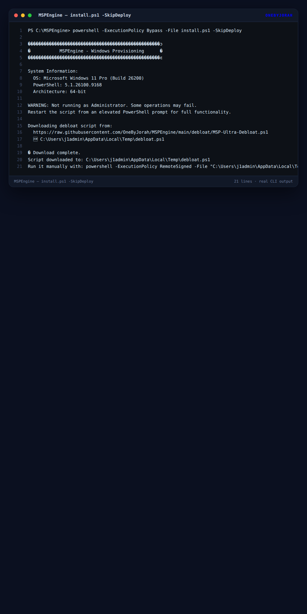
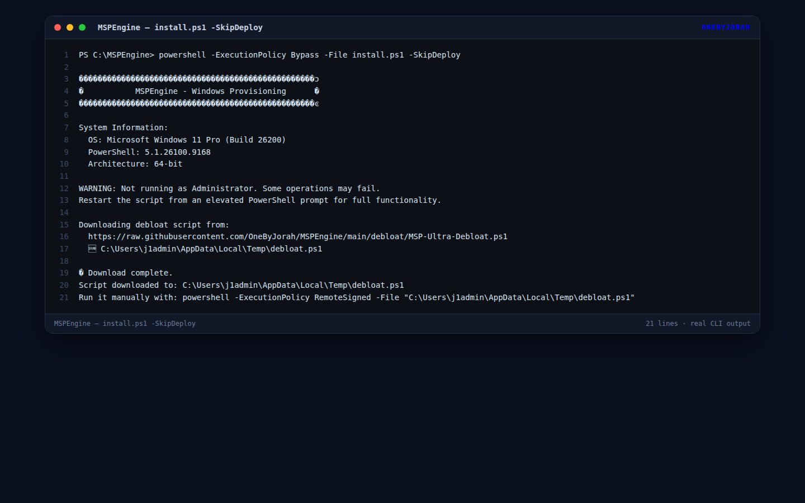

<div align="center">


# MSPEngine

**A Windows 10/11 provisioning and debloat utility for MSP technicians — one parameterized PowerShell script to clean and standardize a fresh install.**

<a href="https://github.com/OneByJorah/MSPEngine/stargazers"></a>
<a href="https://github.com/OneByJorah/MSPEngine/commits"></a>


</div>


## What This Is

MSPEngine provisions and debloats fresh Windows 10/11 workstations for Managed Service Providers. Running one script removes bundled app packages, configures services, and applies power settings that a technician would otherwise set by hand on every machine.

> [!WARNING]
> **Run this from an elevated (Administrator) PowerShell prompt.** MSPEngine downloads and executes a PowerShell script that removes Appx packages, changes service startup types, and sets the active power scheme — all system-level changes. It is Windows-only and cannot be containerized. Review `debloat/MSP-Ultra-Debloat.ps1` before running it in production.

## Quick Start

```powershell
# From an elevated PowerShell prompt (PowerShell 5.1+)
git clone https://github.com/OneByJorah/MSPEngine.git
cd MSPEngine
.\install.ps1
```

Download only, without executing:

```powershell
.\install.ps1 -SkipDeploy
```

## Features

- **One-click setup** — downloads the debloat script and runs it in a single step.
- **Xbox debloat** — removes all Xbox Appx packages from Windows 10/11.
- **Service optimization** — configures Print Spooler and other services.
- **Power configuration** — sets the active power plan to high performance.
- **MSP-optimized** — parameterized for technician workflows and scripted deployment.
- **Remote-ready** — script URL, temp path, and execution policy are all configurable.
- **Dry-run path** — `-SkipDeploy` downloads the payload so it can be reviewed or executed later.

## Architecture

```
MSPEngine/
├── install.ps1                     # Entry point: download + execute
├── debloat/
│   └── MSP-Ultra-Debloat.ps1       # Debloat payload (Appx, services, power)
├── docs/assets/                    # Banner + screenshot
└── README.md
```

`install.ps1` checks the host OS and PowerShell version, verifies elevation, force-enables TLS 1.2 for the download, fetches the payload to `$TempPath`, and (unless `-SkipDeploy`) runs it in a child process before cleaning up the temp file.

## Parameters

| Parameter | Default | Description |
|---|---|---|
| `-ScriptUrl` | MSPEngine raw GitHub URL | Debloat script source |
| `-SkipDeploy` | off | Download only, skip execution |
| `-TempPath` | `$env:TEMP\debloat.ps1` | Download location |
| `-ExecutionPolicy` | `RemoteSigned` | Execution policy for the child process |

## Use Cases

1. **MSP technicians** — provision fresh Windows installs for clients in minutes.
2. **IT departments** — standardize workstation builds across a fleet.
3. **Home users** — strip bundled bloatware from a new machine.

## Requirements

- Windows 10 or Windows 11
- PowerShell 5.1 or later
- An elevated (Administrator) PowerShell prompt

## Tech Stack

PowerShell 5.1+, Windows 10/11, Appx package management.

## Screenshots

| View | |
|---|---|
|  |  |
|  |  |

## Security

See [SECURITY.md](SECURITY.md). Report vulnerabilities to **security@jorahone.com**.

## Contributing

See [CONTRIBUTING.md](CONTRIBUTING.md). [Open an issue](https://github.com/OneByJorah/MSPEngine/issues) for bugs or ideas.

## License

MIT — see [LICENSE](LICENSE).

## Connect

- [jorahone.com](https://jorahone.com)
- [GitHub Org](https://github.com/OneByJorah)
- [info@jorahone.com](mailto:info@jorahone.com)
